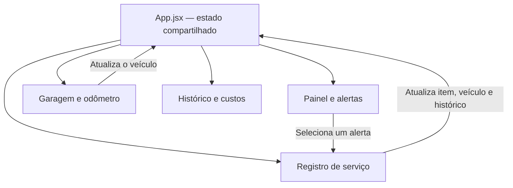

# AutoCUIDA

Aplicação web acadêmica para acompanhamento da manutenção preventiva e
corretiva de veículos.

O projeto está sendo desenvolvido para a disciplina **Programação de Software
para Web**. Nesta etapa, o protótipo HTML foi transformado em uma aplicação
React componentizada e funcional, utilizando somente variáveis e estados locais,
sem back-end ou banco de dados.

## Objetivo

O AutoCUIDA ajuda proprietários de veículos e gestores de pequenas frotas a
evitar manutenções esquecidas e reparos corretivos inesperados. A aplicação
acompanha o odômetro e o tempo transcorrido desde cada serviço para avisar
quando uma nova manutenção está próxima ou vencida.

O fluxo principal implementado permite:

1. visualizar o veículo e seus alertas;
2. atualizar a quilometragem atual;
3. recalcular automaticamente o desgaste dos itens;
4. registrar uma manutenção preventiva ou corretiva;
5. encerrar o alerta atendido e iniciar um novo ciclo;
6. consultar o serviço no histórico e nos custos.

## Funcionalidades implementadas

### Painel

- resumo do veículo e do odômetro atual;
- quantidade de alertas pendentes e críticos;
- cartões reutilizáveis para cada item de manutenção;
- barras e percentuais de desgaste;
- estados visuais **Em dia**, **Próximo** e **Vencido**;
- atalho de um alerta diretamente para o registro do item correspondente.

### Garagem

- apresentação dos dados do veículo cadastrado;
- atualização rápida do odômetro;
- validação de números inteiros e valores negativos;
- bloqueio da redução da quilometragem atual;
- recálculo imediato dos alertas após uma nova leitura.

### Registro de serviço

- seleção entre manutenção preventiva e corretiva;
- seleção do item de manutenção;
- preenchimento de quilometragem, data, valor e oficina/mecânico;
- validação dos campos e impedimento de datas futuras;
- atualização do odômetro quando a quilometragem do serviço for superior;
- baixa automática do alerta atendido;
- atualização da última manutenção e cálculo do próximo ciclo;
- confirmação do lançamento com acesso rápido ao Painel e aos Custos.

### Custos

- total acumulado de despesas;
- média dos últimos seis meses;
- quantidade de serviços registrados;
- gráfico mensal construído com componentes e CSS;
- separação entre gastos preventivos e corretivos;
- histórico ordenado por data, com item, tipo, oficina, quilometragem e valor.

## Regras de manutenção

Cada item possui uma quilometragem e uma data da última manutenção, além de
intervalos por distância e por tempo. O sistema calcula os dois percentuais e
utiliza o mais avançado para determinar o estado do item.

| Percentual de desgaste | Estado | Significado |
| --- | --- | --- |
| Menor que 80% | Em dia | A manutenção ainda está dentro do intervalo |
| De 80% a 99% | Próximo | A manutenção está próxima do limite |
| 100% ou mais | Vencido | O limite de tempo ou quilometragem foi atingido |

Quando um serviço é registrado, a quilometragem e a data informadas tornam-se o
novo ponto inicial daquele item. Isso zera o desgaste, encerra o alerta anterior
e agenda automaticamente a próxima manutenção.

## Estado e fluxo dos dados

O estado compartilhado está no componente `App.jsx` e contém:

- o veículo atual;
- os itens e as regras de manutenção;
- os registros de serviços;
- a tela ativa e o item selecionado.

As páginas recebem esses dados por propriedades e devolvem as alterações por
funções de callback.



Os dados existem apenas na memória do navegador. Ao atualizar ou fechar a
página, a aplicação retorna aos dados definidos em `src/data/initialData.js`.
Esse comportamento é intencional para atender à etapa atual da disciplina.

## Componentização

### Componentes reutilizáveis

- `AppHeader`: título e descrição de cada tela;
- `BottomNavigation`: navegação principal da aplicação;
- `VehicleSummary`: resumo e situação do veículo;
- `MaintenanceCard`: estado, prazo e desgaste de um item;
- `CostSummary`: indicadores financeiros;
- `ExpenseChart`: gráfico dos últimos seis meses;
- `ServiceHistory`: lista dos serviços realizados.

### Páginas

- `DashboardPage`: painel e monitoramento de desgaste;
- `GaragePage`: consulta do veículo e atualização do odômetro;
- `ServicePage`: formulário e confirmação do serviço;
- `CostsPage`: resumo financeiro, gráfico e histórico.

### Funções auxiliares

- `maintenance.js`: formatação e cálculo dos alertas por tempo e quilometragem;
- `costs.js`: formatação monetária, totais e agrupamento mensal de despesas.

## Tecnologias utilizadas

- React 18;
- React DOM;
- Vite 8;
- JavaScript com módulos ES;
- HTML5 semântico;
- CSS responsivo, sem biblioteca visual externa;
- `Intl` para valores, datas e quilometragens no padrão brasileiro.

## Estrutura do projeto

```text
AUTOCUIDA - PSW/
├── src/
│   ├── components/
│   │   ├── AppHeader.jsx
│   │   ├── BottomNavigation.jsx
│   │   ├── CostSummary.jsx
│   │   ├── ExpenseChart.jsx
│   │   ├── MaintenanceCard.jsx
│   │   ├── ServiceHistory.jsx
│   │   └── VehicleSummary.jsx
│   ├── data/
│   │   └── initialData.js
│   ├── pages/
│   │   ├── CostsPage.jsx
│   │   ├── DashboardPage.jsx
│   │   ├── GaragePage.jsx
│   │   └── ServicePage.jsx
│   ├── utils/
│   │   ├── costs.js
│   │   └── maintenance.js
│   ├── App.jsx
│   └── main.jsx
├── index.html
├── style.css
├── package.json
└── vite.config.js
```

Os arquivos HTML da primeira versão foram mantidos na raiz apenas como
referência do protótipo anterior. A aplicação React utiliza o `index.html` como
ponto de entrada.

## Como executar

### Pré-requisito

É necessário ter o Node.js 22 ou superior instalado. O npm é instalado junto
com o Node.js.

### Instalação

Abra um terminal na pasta do projeto e execute:

```bash
npm install
```

### Ambiente de desenvolvimento

```bash
npm run dev
```

O Vite exibirá um endereço semelhante a `http://localhost:5173/`. Mantenha o
terminal aberto e acesse esse endereço no navegador.

### PowerShell com execução de scripts bloqueada

Se o Windows informar que a execução de scripts está desativada, use os
executáveis `.cmd` sem alterar a política de segurança:

```powershell
npm.cmd install
npm.cmd run dev
```

### Build de produção

```bash
npm run build
npm run preview
```

No PowerShell, também podem ser usados `npm.cmd run build` e
`npm.cmd run preview`. O build é gerado na pasta `dist`.

## Roteiro de demonstração

1. Acesse o Painel e observe que o **Óleo do Motor** começa vencido.
2. Clique em **Registrar manutenção** nesse cartão.
3. Confirme o item selecionado e preencha valor e oficina.
4. Clique em **Registrar serviço**.
5. Volte ao Painel e confira que o item passou para **Em dia**, com 0% de
   desgaste e um novo prazo.
6. Acesse Custos e confira o lançamento no total, no gráfico e no histórico.
7. Na Garagem, aumente o odômetro e volte ao Painel para observar o recálculo.

## Validação realizada

- build de produção concluído com sucesso;
- componentes e módulos processados pelo Vite sem erros;
- estados iniciais dos alertas conferidos;
- atualização do odômetro validada;
- baixa de alerta e criação do próximo ciclo verificadas;
- atualização de totais, gráfico e histórico verificada;
- auditoria das dependências concluída sem vulnerabilidades conhecidas.

## Limitações da versão atual

- os dados não persistem após recarregar a página;
- existe somente um veículo de demonstração;
- ainda não há autenticação ou perfis de acesso;
- não existe integração com API, servidor ou banco de dados;
- os itens e intervalos de manutenção ainda não possuem tela própria de CRUD;
- registros existentes ainda não podem ser editados ou excluídos.

Esses pontos pertencem às próximas fases do projeto e não impedem a
demonstração do fluxo principal solicitado nesta etapa.

## Documentação de referência

- [Descrição do protótipo](docs/prototipo.md)
- [Validação dos requisitos](docs/validacao-requisitos.md)

Os documentos de planejamento foram convertidos para Markdown em 25/09/2026.
Os originais em TXT e DOCX permanecem recuperáveis no commit `b59f1ab`.
